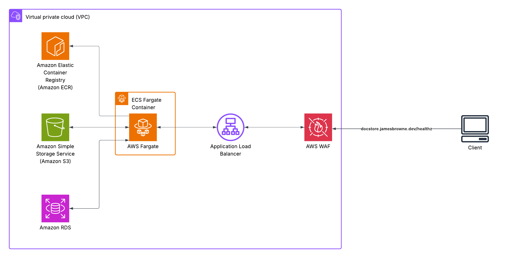

# FastAPI Document Storage Service
A Python FastAPI service for secure per-user document upload, listing, and deletion, with S3-compatible storage and JWT authentication.

## Contents
- [Features](#features)
- [Cloud infrastructure diagram](#cloud-infrastructure-diagram)
- [Live demo](#live-demo)
  - [How to use](#how-to-use)
- [Video demo](#video-demo)
- [Requirements](#requirements)
- [Run locally](#run-locally)
- [Stack](#stack)
- [API endpoints](#api-endpoints)
- [Development plan](#development-plan)
- [API Testing with Postman](#api-testing-with-postman)
- [Documentation](#documentation)

## Features
- Per-user secure document storage and access control
- Unique filenames enforced per user to prevent duplicates
- JWT-based authentication for all endpoints
- Presigned S3 URLs for secure file downloads
- CI with LocalStack S3, Postgres, and pytest for testing
- Deployment with AWS

## Cloud infrastructure diagram

This diagram shows the backend cloud infrastructure and how the document storage service operates



## Live Demo

Try the service live at:
**[docstore.jamesbrowne.dev](https://docstore.jamesbrowne.dev)**

### How to Use
1. Register a new user via `/auth/register`
2. Log in to get a JWT token via `/auth/login`
3. Use the token to access document endpoints

## Video Demo

[](https://jamesbrowne.dev/posts/fastapi-document-storage-service/#demo-video)

Click the image above to watch a demonstration of the document storage API

## Requirements

- Python 3.10+
- Docker

## Run locally

> The `.env.example` and `docker-compose.yml` files are provided **only for local development and testing**.  
> **Do not use these files for production deployments.**  
> If deploying create your own `.env` and `docker-compose.yml` with secure, production-ready settings.

1. **Copy sample .env file to .env**
    
    **macOS/Linux:**
    ```bash
    cp .env.sample .env
    ```
    
    **Windows:**
    ```cmd
    copy .env.sample .env
    ```

2. **Start dependencies with Docker Compose**

    ```bash
    docker compose up -d
    ```

3. **Create a virtual env and install dependencies**
   
    **macOS/Linux:**
    ```bash
    python3 -m venv .venv
    source .venv/bin/activate
    pip install -U pip
    pip install -r requirements.txt
    ```
    
    **Windows:**
    ```cmd
    python -m venv .venv
    .venv\Scripts\activate
    pip install -U pip
    pip install -r requirements.txt
    ```

4. **Run database migrations**:

    ```bash
    alembic upgrade head
    ```

5. **Start the API**

	```bash
	uvicorn app.main:app --port 8000
	```

6. Open [http://127.0.0.1:8000](http://127.0.0.1:8000) and check `/healthz` or the docs at `/docs`.

## Stack
- Python
- FastAPI
- PostgreSQL
- S3-compatible storage (AWS S3 or LocalStack)

## API endpoints (MVP)
- Auth
	- POST /auth/register — create user
	- POST /auth/login — get JWT access (and optional refresh)
	- GET  /me — current user (requires Bearer token)
- Documents
	- POST /documents/upload — upload file (or presigned flow later)
	- GET  /documents — list user documents
	- DELETE /documents/{id} — delete document
- Health
	- GET /healthz — liveness check

## Development plan:
- Setup repo, envs, project structure, etc
- Implement basic API auth endpoints
- Implement document upload
- Observability: structured logs, metrics, tracing
- Tests & CI: unit/integration/E2E + GitHub Actions, pre-commit hooks
- Deploy: Docker Compose for dev; cloud Postgres + object storage

## API Testing with Postman

A ready-to-use Postman collection is provided in [`postman/fastapi-docstore.postman_collection.json`](postman/fastapi-docstore.postman_collection.json).

- Import this collection into Postman to try out all API endpoints.
- Update the environment variables (such as base URL and JWT token) as needed for your setup.

## Documentation

Full API documentation is available at:
[docstore.jamesbrowne.dev/redoc](https://docstore.jamesbrowne.dev/redoc)
